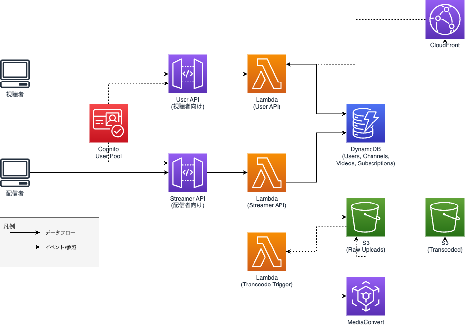

# サブスクリプション型動画配信プラットフォーム

AWS CDKを用いた、サブスクリプション型の動画配信プラットフォームのインフラストラクチャ構築プロジェクトです。

## 概要

配信者が動画をアップロードし、視聴者がチャンネルをサブスクリプションして動画を視聴できるプラットフォームをAWS上に構築しました。動画の自動トランスコード、CDN配信、認証・認可機能を実装しています。

## アーキテクチャ



## 主な機能

### 視聴者向け機能
- チャンネル一覧・詳細閲覧
- 動画視聴（サブスクリプションチャンネルのみ）
- サブスクリプション管理

### 配信者向け機能
- チャンネル作成
- 動画アップロード（署名付きURL経由）
- 動画公開管理

## 技術スタック

### インフラストラクチャ
- **IaC**: AWS CDK (TypeScript)
- **認証**: Amazon Cognito
- **API**: API Gateway + Lambda
- **データベース**: DynamoDB
- **ストレージ**: Amazon S3
- **動画処理**: AWS MediaConvert
- **配信**: Amazon CloudFront

### 使用サービス一覧
| サービス | 用途 |
|---------|------|
| Cognito | ユーザー認証・グループ管理（視聴者/配信者） |
| API Gateway | RESTful API エンドポイント |
| Lambda | ビジネスロジック処理 |
| DynamoDB | ユーザー・チャンネル・動画・サブスクリプションデータ管理 |
| S3 | 動画ファイルストレージ（アップロード用/変換済み） |
| MediaConvert | 動画の自動トランスコード |
| CloudFront | 動画のCDN配信 |

## プロジェクト構成

```
.
├── bin/
│   └── app.ts              # CDKアプリケーションエントリーポイント
├── lib/
│   ├── auth-stack.ts       # Cognito認証基盤
│   ├── dynamo-stack.ts     # DynamoDBテーブル定義
│   ├── api-user-stack.ts   # 視聴者向けAPI
│   ├── api-streamer-stack.ts # 配信者向けAPI
│   ├── mediaconvert-stack.ts # 動画トランスコード処理
│   └── cloudfront-stack.ts # CDN配信設定
└── docs/
    └── architecture.drawio.png # アーキテクチャ図
```

## セットアップ

### 前提条件
- Node.js 20.x以上
- AWS CLI設定済み
- AWS CDK CLI (`npm install -g aws-cdk`)

### 手順

1. **依存関係のインストール**
```bash
npm install
```

2. **S3バケットの作成**（事前に手動作成が必要）
```bash
aws s3 mb s3://subscription-streaming-vod-raw-uploads --region ap-northeast-1
aws s3 mb s3://subscription-streaming-vod-transcoded --region ap-northeast-1
```

3. **CDKのブートストラップ**（初回のみ）
```bash
cdk bootstrap
```

4. **デプロイ**
```bash
npm run build
cdk deploy --all
```

## API エンドポイント

### 視聴者向けAPI
- `GET /channels` - チャンネル一覧取得
- `GET /channels/{id}` - チャンネル詳細取得
- `GET /videos/{id}` - 動画詳細取得（要認証）
- `GET /me/subscriptions` - サブスクリプション一覧取得（要認証）

### 配信者向けAPI
- `POST /channels` - チャンネル作成（要認証）
- `POST /videos/upload-url` - アップロード用署名付きURL取得（要認証）
- `GET /creator/videos` - 自分の動画一覧取得（要認証）
- `POST /creator/videos/{id}/publish` - 動画公開（要認証）

## 設計のポイント

### セキュリティ
- Cognito User Poolsによる認証基盤
- API Gatewayのオーソライザーで認可制御
- 配信者グループによるロールベースアクセス制御

### スケーラビリティ
- DynamoDB（オンデマンドモード）による自動スケーリング
- Lambda関数による柔軟なコンピューティングリソース管理
- CloudFrontによるグローバルなコンテンツ配信

### 動画処理フロー
1. 配信者が署名付きURLでS3にアップロード
2. S3イベントでLambdaトリガー
3. MediaConvertで自動トランスコード（HLS/DASH形式）
4. 変換済み動画をCloudFront経由で配信
